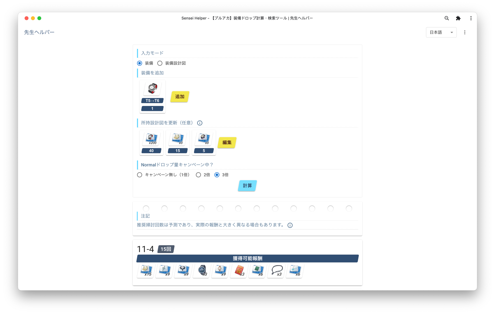

# 先生助手(Sensei Helper)

## 日本語 | [English](../../README.md) | [中文](../cn/README.md)

### 先生助手とは？
先生助手は、スマホゲーム『ブルーアーカイブ』の非公式装備ドロップ場所計算・検索ツールです。

### サイトのURLを教えて下さい
[こちら](https://sensei.help)からご覧いただけます。

### 連絡先など
* [Github](https://github.com/edwardez/sensei-helper/issues)
* [Twitter](https://twitter.com/sensei_helper)
